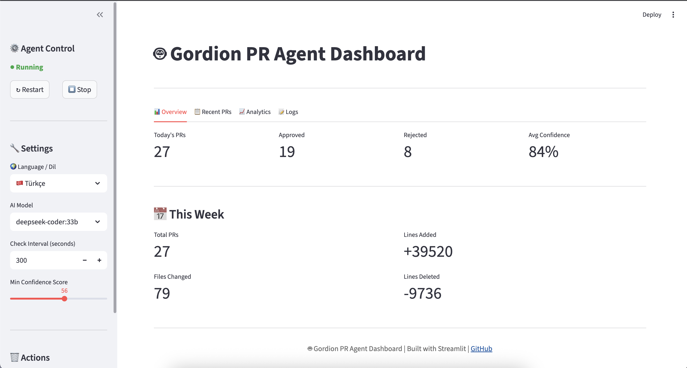
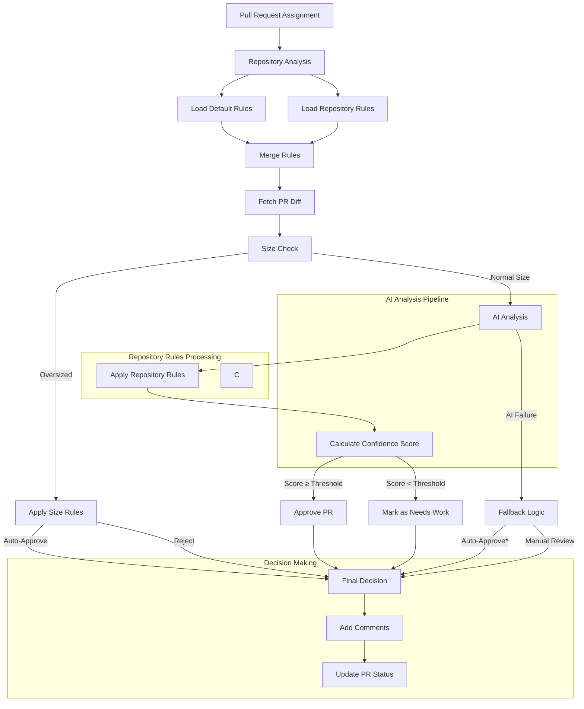

<div align="center">

# 🗡️ Gordion AI Code Review Agent

**Cut through complexity. Approve with confidence.**

*Inspired by the Gordian Knot legend – solve difficult code reviews with decisive AI insight.*

[](https://www.python.org/downloads/)
[](https://www.atlassian.com/software/bitbucket)
[](https://ollama.com/)

**[🚀 Quick Start](#-quick-start) • [✨ Features](#-features) • [🖥 Dashboard](#-dashboard) • [🛡 Security & Auth](#-security--authentication) • [⚙ Configuration](#-configuration) • [📊 How It Works](#-how-it-works) • [🧪 Testing](#-testing) • [🤝 Contributing](#-contributing)**

<br/>

### 🌍 Supported Platforms (Today & Roadmap)

✅ Bitbucket Server / Stash (legacy & latest on‑prem versions)  
✅ Bitbucket Cloud (current API)  
🛠 Roadmap: GitHub, GitLab, Azure DevOps, Gitea – powered by open source contributions.  

Have interest in another VCS? Open an issue or PR – adapter design makes adding providers straightforward.

</div>

---

## 🎯 What Is Gordion?
Gordion is an autonomous AI agent that reviews Pull Requests assigned to you on **Bitbucket Server (Stash)**. It fetches diffs, analyzes changes with **local Ollama models** or **OpenAI GPT-4**, assigns a confidence score, and decides to approve or flag as "Needs Work" – optionally adding inline comments. If the AI layer fails, a smart fallback ensures the PR flow never blocks.

**Why it matters:** Manual review queues waste engineering time. Gordion keeps velocity high while surfacing meaningful issues.

---

## ✨ Features

| Area | Highlights |
|------|------------|
| AI Analysis | Security, performance, style, maintainability, patterns |
| Inline Feedback | Line‑by‑line suggestions on reject (configurable) |
| Smart Fallback | Auto-approve when AI is unavailable (optional) |
| Local AI | 100% private & free via Ollama (Apple Silicon optimized) |
| Multi-Language | English & Turkish prompt packs (easy to extend) |
| Dashboard | Real‑time stats, history, logs, controls, settings |
| Configurability | YAML thresholds, prompt overrides, language toggle |
| Security | Personal Access Tokens, minimal scope, audit trail |
| Oversized Handling | Large PRs can auto‑approve or be flagged based on config |
| Extensibility | Add new models & languages with minimal changes |
| Repository Rules | Custom rules & prompts per repository |


---

## 🚀 Quick Start

### Option A: Dashboard (Recommended)

```bash
git https://github.com/mesutpiskin/gordion.git
cd gordion-ai-review
cp .env.example .env
nano .env       # Set STASH_URL + STASH_TOKEN
./start_dashboard.sh
```
Dashboard: http://localhost:8501

### Option B: Headless Agent
```bash
./setup.sh
python3 tests/test_connection.py
./agent.sh start
./agent.sh status
./agent.sh logs
```

### Minimal .env
```env
STASH_URL=https://stash.yourcompany.com
STASH_TOKEN=your_personal_access_token
AI_PROVIDER=ollama        # or openai
OLLAMA_URL=http://localhost:11434
OLLAMA_MODEL=llama3.1:8b
CHECK_INTERVAL=300        # seconds between scans
DRY_RUN=false             # true = simulate only
```

---

## 🖥 Dashboard
| Section | Purpose |
|---------|---------|
| Overview | Daily PR activity, approvals, rejects, confidence averages |
| Recent PRs | Full decision history + AI reasoning text |
| Analytics | Trends (7d/30d/all), status distribution, approval trajectory |
| Logs | Live streaming tail with severity coloring |
| Controls | Start / Stop / Restart agent; switch model / interval / language |
| Settings | Adjust thresholds & toggle inline comments | 

<p align="center">
  
</p>

---

## 🏃 Run Modes

Choose the mode that fits your environment:

### 1. Terminal (Interactive)
Best for evaluation & development.
```bash
./agent.sh start      # start in background
./agent.sh logs       # follow output
./agent.sh restart    # reload
./agent.sh stop       # stop
```

### 2. Service Agent (Background Daemon)
Use system service (e.g. `launchd` on macOS or `systemd` on Linux) for always‑on operation.
Example (systemd):
```bash
sudo cp stash-agent.service /etc/systemd/system/
sudo systemctl enable stash-agent
sudo systemctl start stash-agent
sudo systemctl status stash-agent
```
macOS (launchd):
```bash
cp com.company.stash-agent.plist ~/Library/LaunchAgents/
launchctl load ~/Library/LaunchAgents/com.company.stash-agent.plist
launchctl start com.company.stash-agent
```

### 3. Dashboard Control Panel
Web UI provides start/stop/restart buttons, live logs, config edits and language/model switches.
```bash
./start_dashboard.sh   # opens http://localhost:8501
```

### Comparison
| Mode | Best For | Persistence | UI | Setup Effort |
|------|----------|-------------|----|--------------|
| Terminal | Local dev & debugging | Manual | CLI logs | Minimal |
| Service Agent | Production / always-on | Automatic | None | Moderate |
| Dashboard | Monitoring & tuning | Manual (agent internal) | Rich Web | Minimal |

---

---

## 🛡 Security & Authentication

### Personal Access Token (Preferred)
- Least-privilege scopes (REPO_READ + REPO_WRITE)
- Revocable & auditable
- No password storage

Add to `.env`:
```env
STASH_TOKEN=your_token
```

### Username + Password (Legacy)
Use only if tokens unsupported (< v5.5).
```env
STASH_USERNAME=your_username
STASH_PASSWORD=your_password
```

### Data Privacy
- Code never leaves your infra when using Ollama.
- No proprietary code logged beyond necessary metadata.
- Sensitive files can be excluded / never auto‑approved.

---

## ⚙ Configuration

`config/config.yaml` excerpt:
```yaml
approval_criteria:
  min_confidence_score: 70
  max_files_changed: 50
  max_lines_changed: 1000
  auto_approve_on_ai_failure: true
  auto_approve_oversized: true
  comment_on_reject: true
  mark_needs_work_on_reject: true
  decline_on_reject: false
  add_inline_comments_on_reject: true

ai:
  ollama_model: "llama3.1:8b"
  temperature: 0.3
  max_tokens: 2000

language: en   # or 'tr'
```


### How to Customize System Promts

1. **Create/Edit Repository Rules**
   Navigate to `config/repository_rules.yaml` and add your repository configuration:
   ```yaml
   repositories:
     your-repo-name:           # Must match your Bitbucket repository name
       description: "Brief description of your service"
       tech_stack:             # Define your technology stack
         language: "java"      # Programming language
         version: "17"        # Language version
         framework: "spring-boot"
         database: "postgresql"
         # Add any other tech stack details
       
       rules:                 # List of specific rules for this repository
         - "Rule 1: Description"
         - "Rule 2: Description"
       
       prompts:              # Custom prompts for different operations
         code_review: |      # Used during code review
           When reviewing this repository, ensure:
           1. Rule-specific check
           2. Another check...
         
         pr_analysis: |      # Used during PR analysis
           For pull requests in this repository:
           1. Specific check
           2. Another check...
   ```

2. **Override Default Prompts**
   - Repository-specific prompts in `repository_rules.yaml` override default prompts
   - You can reference repository details in your prompts:
    ```yaml
    language: en
    en:
      pr_analysis_system_prompt: |
        You are a senior engineer. Evaluate code for security, performance,
        maintainability, readability and architectural conformity.
        Highlight critical issues and suggest improvements succinctly.
    ```

3. **Testing Your Rules**
   - Create a test PR in your repository
   - Check the agent logs to verify your rules are being applied
   - Review the AI analysis to ensure custom prompts are working

4. **Best Practices**
   - Keep rules specific and actionable
   - Include both technical and process requirements
   - Update rules when project requirements change
   - Document special cases or exceptions
   - Use clear, unambiguous language

5. **Example Use Cases**
   - Enforcing team-specific coding standards
   - Managing different tech stacks across repositories
   - Implementing security requirements per service
   - Customizing review depth based on repository criticality

---

## 📊 How It Works


Process runs every `CHECK_INTERVAL` seconds with the following flow:

1. **Repository Configuration**
   - Load repository-specific rules from `repository_rules.yaml`
   - Apply custom prompts and technical requirements
   - Set language-specific analysis parameters

2. **Pull Request Analysis**
   - Check PR size against configured limits
   - For oversized PRs: Apply configurable auto-approve rules
   - For normal PRs: Proceed to deep analysis

3. **AI Processing**
   - Apply repository-specific prompts
   - Analyze code changes using Ollama/OpenAI
   - Consider tech stack requirements
   - Validate against repository rules

4. **Decision Making**
   - Calculate confidence score based on analysis
   - Apply repository-specific thresholds
   - Handle AI failures with configurable fallback
   - Generate structured feedback

5. **Action Execution**
   - Update PR status (Approve/Needs Work)
   - Add inline comments if configured
   - Provide detailed reasoning in PR comment
   - Log decision and metrics

*Note: Fallback behavior is configurable via `config.yaml`

### Decision Logic (Default)
- Approve when `confidence >= 70`, size within limits.
- Mark Needs Work when confidence below threshold (add structured feedback + optional inline comments).
- Fallback auto‑approve if AI unavailable (logged distinctly).

---

## 🧪 Testing
```bash
python3 tests/test_connection.py      # Bitbucket API
python3 tests/test_ollama.py          # Local model health
AI_PROVIDER=openai python3 tests/test_ai.py  # OpenAI path
python3 tests/test_inline_comments.py # Inline logic
DRY_RUN=true python3 src/main.py      # Simulate without approving
```

---

## 🛠 Customization Checklist
| Goal | Where |
|------|-------|
| Change approval strictness | `config/config.yaml` (min_confidence_score) |
| Adjust size limits | `config/config.yaml` (max_* fields) |
| Modify AI prompts | `config/prompts.yaml` |
| Switch provider | `.env` (AI_PROVIDER) |
| Add language | New block in `prompts.yaml` + dashboard selector |
| Disable inline comments | Set `add_inline_comments_on_reject: false` |
| Safe trial mode | `.env` `DRY_RUN=true` |

---

## 📦 Project Structure
```
stash-agent/
├─ src/                # Agent core, dashboard
├─ config/             # YAML config & prompts
├─ tests/              # Test scripts
├─ docs/               # en/ & tr/ documentation
├─ logs/               # Runtime logs
├─ agent.sh            # Control script
├─ start_dashboard.sh  # Dashboard launcher
└─ requirements.txt    # Python dependencies
```

---

## 🤝 Contributing
1. Fork → feature branch → PR.
2. Keep changes focused & documented.
3. Add/adjust tests if logic changes.
4. Update docs for new config or behaviors.

### Local Dev
```bash
git https://github.com/mesutpiskin/gordion.git
cd gordion-ai-review
pip install -r requirements.txt
./start_dashboard.sh
```

### Adding a Language
1. Duplicate prompt section in `config/prompts.yaml`.
2. Translate all templates.
3. Add language option in dashboard selector.
4. Provide docs under `docs/<lang>/`.

---

## 🙏 Acknowledgments
- Ollama & open-source LLM communities.
- Streamlit for rapid UI.
- The Gordian Knot legend for thematic inspiration.

---

## 📞 Support
- Docs: `docs/en/` (Turkish: `docs/tr/`)
- Issues: GitHub Issues
- Ideas / Q&A: GitHub Discussions

---

<div align="center">

**⚔️ Cut through complexity. Review with precision. Ship faster.**

Made with ❤️ by developers, for developers.

[⬆ Back to Top](#-gordion-ai-code-review-agent)

</div><div align="center"><div align="center"># 🤖 Pull Request Review Agent